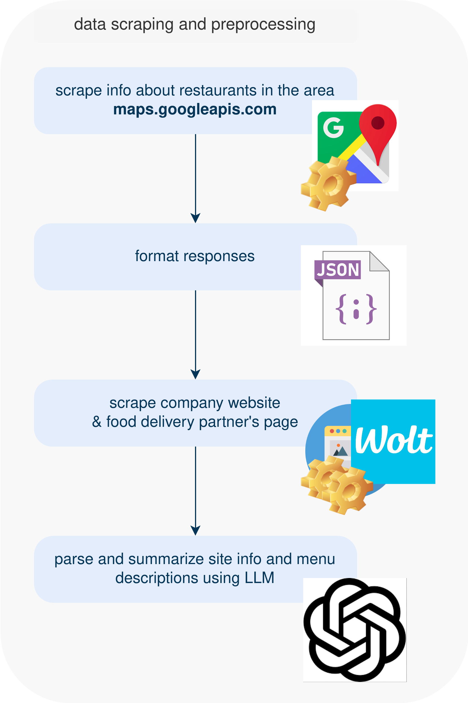
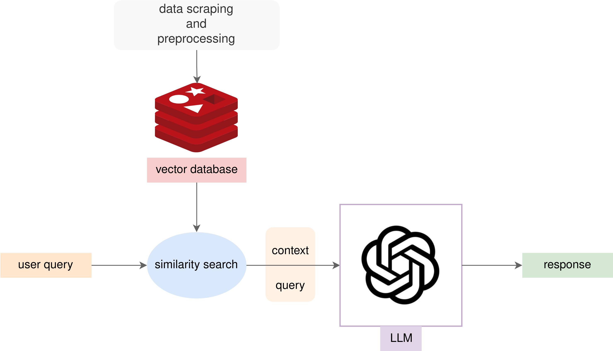

<p align="center"></p>

# Gde na klopu
Aplikacija koja koristi AI agente kako bi vam pružila preporuke o mestima za jelo u jednom gradu. Aplikacija vam omogućava da pošaljete poruku sa željenom hranom, a naši AI agenti će vam dati predloge restorana i drugih mesta gde možete pronaći tu hranu.

## Pokretanje
Pokretanje se može podeliti na dva dela: pokretanje glavne aplikacije i pokretanje prikupljača podataka.

### Preduslovi
- Docker
- Docker Compose
- Python 3.8 or higher

### Pokretanje glavne aplikacije
```
docker compose -f docker-compose.yml up --build
```
Nakon uspešnog pokretanja aplikaciju možete otvoriti na linku
```
`http://localhost:8501/`
```

### Pokretanje prikupljača podataka
Ovi koraci ce pokrenuti prikupljanje celokupnih podataka. Samo prikupljanje je podeljeno u tri faze ne bi li se omogućilo olakšano ponavljanje prikupljanja samo željenih koraka. 
```
# Instaliranje zavisnosti
pip3 install scraper/requirements.txt

# Exportovanje varijabli
export OPENAI_API_KEY=<YOUR API KEY>
export GMAP_API_KEY=<YOUR API KEY>

# Prikupljanje podataka sa google mapa
python3 scraper/google_maps_fetch.py

# Prikupljanje podataka sa Web-sajta restorana i Wolta sa kreiranjem rezimea korišćenjem OpenAI API.
python3 scraper/preprocessor.py

# Formatiranje prikupljenih podataka u pogodnu formu za unos u vektorsku bazu.
python3 scraper/file_formatter.py
```

## Arhitektura
### Sistem prikupljanja podataka
Naš sistem za prikupljanje podataka o restoranima koristi sledeće korake:

1. **Prikupljanje podataka o restoranima sa Google Maps**
    * Sistem prikuplja podatke o restoranima, njihovim detaljima i recenzijama koristeći Google Maps API.
    * Ovaj korak obezbeđuje osnovne informacije o restoranima, uključujući lokaciju, radno vreme, ocene i recenzije korisnika.
2. **Scraping podataka sa Wolt-a i zvaničnih sajtova restorana**
    * Nakon identifikacije restorana, sistem prikuplja dodatne podatke sa Wolt-a i zvaničnih web sajtova restorana.
    * Sadržaj sa ovih sajtova se koristi za dodatne informacije opise sadžaja restorana koje se ubacuju u OpenAI API kako bi se izvukli sažeci specifični za svaki restoran.
3. **Formatiranje podataka za vektorizovanu bazu podataka**
    * Prikupljeni i sažeti podaci se formatiraju kako bi bili u skladu sa formatom koji se može uneti u vektorizovanu bazu podataka.
    * Ovaj korak omogućava efikasno pretraživanje i analizu podataka od strane AI agenata, pružajući korisnicima tačne i relevantne preporuke.

<p align="center">
    
</p>

### Glavna aplikacija
Naša aplikacija omogućava korisnicima interakciju sa sistemom putem jednostavnog i intuitivnog frontend-a, pružajući preporuke restorana bazirane na korisničkim upitima. Glavne funkcionalnosti aplikacije uključuju:
1. **Korisnički interfejs za interakciju (Streamlit frontend)**
    * Korisnici mogu jednostavno slati upite putem user-friendly frontend-a zasnovanog na Streamlit-u.
    * Interfejs je dizajniran da bude intuitivan i lako razumljiv, omogućavajući korisnicima da brzo dobiju željene informacije.
2. **Pretraga sličnosti u vektorizovanoj bazi podataka (Redis)**
    * Na osnovu korisničkog upita, sistem vrši pretragu sličnosti u vektorizovanoj bazi podataka koja je smeštena u Redis dockerizovanoj instanci.
    * Ovaj korak osigurava brzo i efikasno pretraživanje relevantnih podataka o restoranima.
3. **Preprocesiranje upita i kontekstualna pretraga**
    * Nakon pretrage sličnosti, kontekstualni upit se preuzima iz vektorizovane baze podataka i šalje OpenAI API-ju.
    * Pre slanja upita, vrši se dodatno preprocesiranje kako bi se osiguralo da samo upiti koji su relevantni za aplikaciju budu prosleđeni LLM-u.
4. **Odgovor LLM-a i povratak korisniku**
    * Odgovor generisan od strane LLM-a se direktno vraća na korisnički frontend.
    * Korisnici odmah dobijaju relevantne preporuke i informacije na osnovu njihovih upita.

<p align="center">
    
</p>

## Tim
👤 [Emanuilo Jovanović](https://www.linkedin.com/in/emanuilo-jovanovic-112b7713a/) - *Senior ML Engineer* </br>
👤 [Marko Nikić](https://www.linkedin.com/in/marko-nikic-471374229/) - *Software Engineer II* </br>
👤 [Milan Lazarević](https://www.linkedin.com/in/mrlaki5/) - *Senior Embedded AI Engineer* </br>

